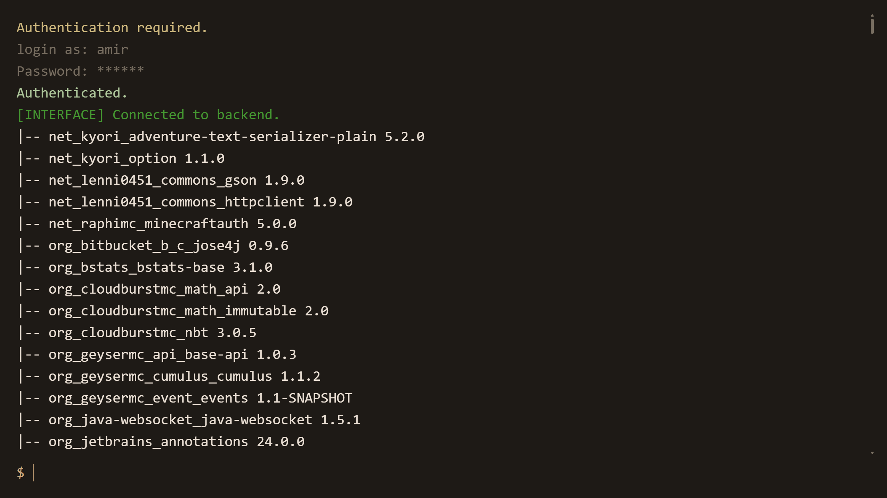

## Web Interface | A simple web-based console connected directly to a process in your system

This very simple web interface (which is just called **WebInterface**, *meaning an interface on the web*) is the fastest way to manage your processes from anywhere on the web, with *good enough* authentication system which protects the process from bots and users trying to crack the credentials.

## Installation

> [!NOTE]
> 
> There is no installer package or installer script included. 
> 
> The interface is run via python and needs editing the `config.py` file by hand. This is because currently, i want to keep the system simple and portable (this can change later).

Simple copy this repository's files to an arbitrary directory. You can do this by running `git clone https://github.com/amirgame197/WebInterface` or press the big green `<> Code` button on top of this page, and then press the `Download ZIP` button.

> [!TIP]
> If you downloaded the ZIP files, you need to extract them first. You can do this by simply running the `unzip WebInterface*` command.

## Configuration & Setup

Wherever you placed the `WebInterface` folder, there is a `config.py` file inside it. Any configurations you need is available in that file and will be read by `server.py`. 

### Interface settings

| Feature | Default value | Description |
| --- | --- | --- |
| TITLE_NAME | `Process Console` | The name that appears on top of the interface as the title/ |
| THEME_COLORS | `#1f1a16`, `#2a231e`, `#ede0d4`, ... | The interface's styling colors. You can play with these values to find your preferred style/ |
| USERNAME | `admin` | Authentication username/ |
| PASSWORD | `admin` | Authentication password, stored in the raw file **`*`**. |
| AUTH_RPM | `30` |  |

> **`*`**. The reason the password is not stored in hash is that the interface is accessible through the system already, which would eliminate the point of the interface, therefore storing the hashed password would be pointless.<br>
> This is a subject of change.

### Server settings

| Feature | Default value | Description |
| --- | --- | --- |
SECRET_KEY | `HASH` | A secret key generated **`*`** that the interface's underlying server (**Flask**) uses to encrypt data. |
MAX_CONTENT_LENGTH | `16 * 1024 * 1024` | Maximum amount of a single transfer's size in bytes |
SESSION_TIMEOUT | `600` | The time of inactivity that triggers authentication, in seconds. |
LISTEN_IP | `0.0.0.0` | The address that the server is listening to. `0.0.0.0` for network-wide and `127.0.0.1` for local-only |
LISTEN_PORT | `0000` | The port that the server is listening to **`**`**. |

> **`*`**. You can generate a key by using the command below. It's a 32bit hex token:
>
> `python -c "import secrets; print(secrets.token_hex(32))"`

> **`**`**. *0000* is **not a real port and you must change this value** to your preferred port (*typically between 1024 - 65535*)

### Process settings

| Feature | Default value | Description |
| --- | --- | --- |
PROCESS_CMD | `python3 ./example_process.py` | Full command to launch the process, possibly with arguments. By default, it will have the same permissions as this user **`*`**. |
PROCESS_WORKING_DIR | `./` | The working directory of launched process. Default is here |
PROCESS_MAX_LINES | `500` | Maximum amount of lines stored inside the ram, received by the client after authentication |

> **`*`**. This command will run as a shell command. That means it will be detached from the interface's server and will have its own process group.<br>
> If the process can possibly give system wide access to the user, say, by commands, any user authenticated to the interface will be able to gain system wide access. Therefore, ensure that the process is safe and the users are not malicious.

## Running the Interface

Once the configuration is done, the interface can be launched simply by running `python3 WebInterface/server.py`. Though, it will be shut down and the process will be killed if you close the terminal.

> [!TIP]
> If you want the interface to remain active even after the window is closed, you need to create a service.<br>
> This can be done by creating an `NSSM` service process in Windows, or a `systemd` service file in Linux.

### Windows (NSSM)
1. Run `nssm` install command:
    ```bash
    nssm install my-interface-instance
    ```

2. A GUI window opens, you should select python as the application with `server.py` argument and with correct working directory.
    ```bash
    # Check the service status
    nssm status my-interface-instance

    # Start, restart or stop the service
    nssm restart my-interface-instance
    nssm stop my-interface-instance
    ```

### Linux (systemd)
1. Create `/etc/systemd/system/my-interface-instance.service` file:
    ```ini
    [Unit]
    Description=My Interface Instance
    After=network.target

    [Service]
    Type=simple
    Restart=on-failure
    RestartSec=5s
    WorkingDirectory=/PATH/TO/PROCESS
    ExecStart=python3 WebInterface/server.py

    [Install]
    WantedBy=multi-user.target
    ```

2. Edit the `/PATH/TO/PROCESS` according to your absolute server directory. After that:
    ```bash
    # Enable the service to run on startup
    systemctl enable my-interface-instance

    # Check the service status
    systemctl status my-interface-instance
    
    # Or check its logs in real-time
    journalctl -u my-interface-instance -f

    # Start, restart or stop the service
    systemctl restart my-interface-instance
    systemctl stop my-interface-instance
    ```